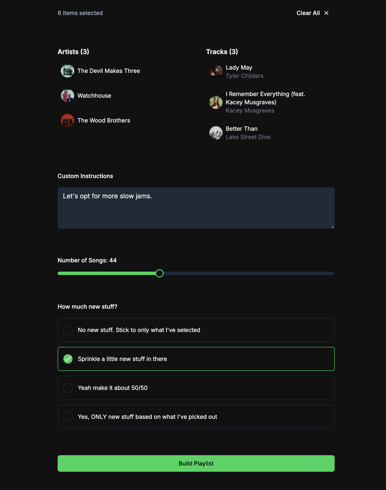
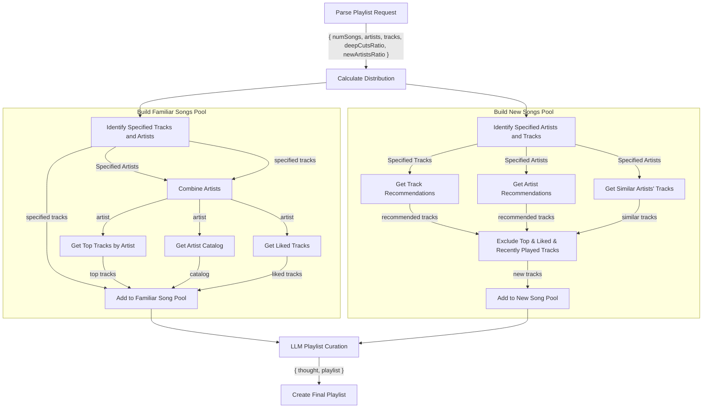
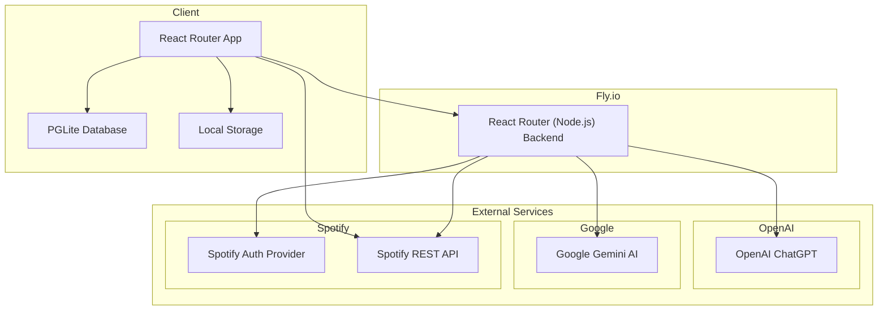
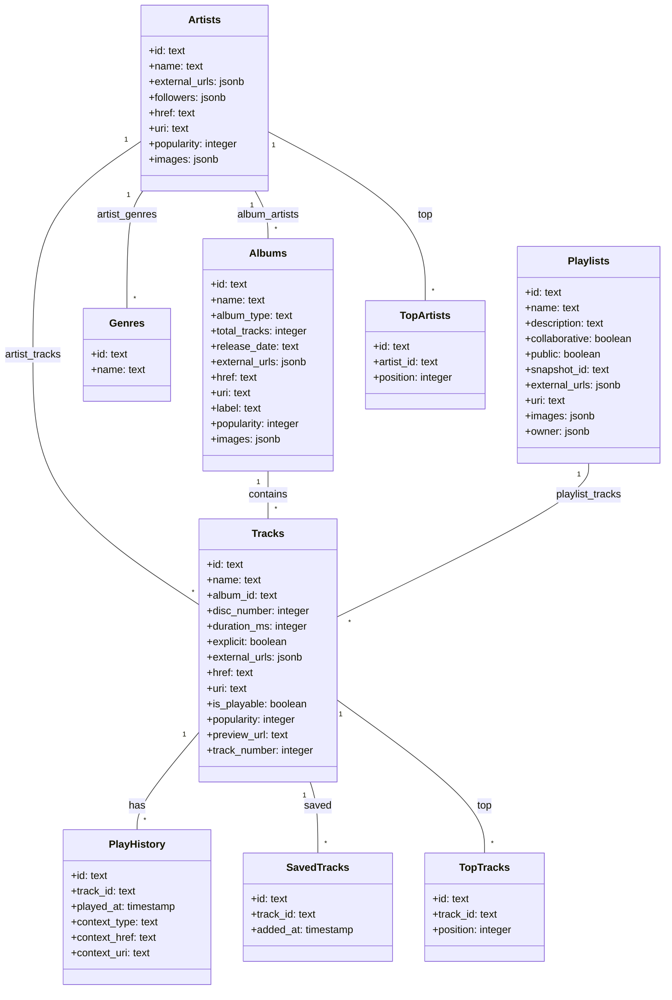
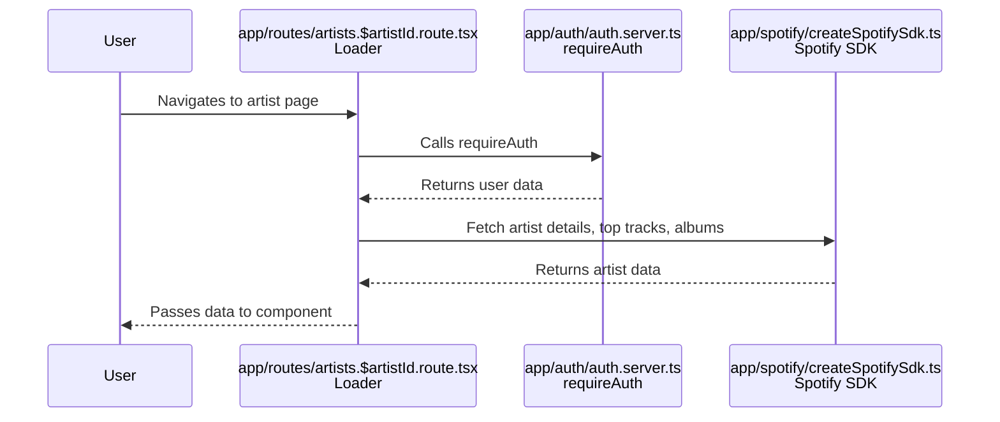

# Better Spotify

Spotify is good but...

- I want Artist Radio but based on multiple artists
- I want to be introduced to fresher new music. Spotify's recommendations always feel stale.



Table of Contents

- [Playlist Builder Algorithm](#playlist-builder-algorithm)
- [Architecture](#architecture)
- [Tech Stack](#tech-stack)
- [Project Structure](#project-structure)
- [Data Model](#data-model)
- [Data Access](#data-access)
  - [Database and ORM](#database-and-orm)
  - [Data Access Patterns](#data-access-patterns)
  - [Database Initialization and Access](#database-initialization-and-access)
  - [Database Migrations](#database-migrations)
- [External APIs](#external-apis)
- [Routing](#routing)
- [Screens](#screens)
- [Auth](#auth)
  - [How do we know who they are?](#how-do-we-know-who-they-are)
    - [Example Usage](#example-usage)
  - [How do we know what they are allowed to do?](#how-do-we-know-what-they-are-allowed-to-do)
    - [Example Usage](#example-usage-1)
- [Data Fetching](#data-fetching)
- [Step-by-Step Walkthrough of a Typical User Request](#step-by-step-walkthrough-of-a-typical-user-request)

## Playlist Builder Algorithm

View the full details in [/docs/playlist-building-process.md](docs/playlist-building-process.md)



## Architecture

The app is build with React Router 7, a full stack React metaframework (formerly Remix). It makes heavy use of clientside data storage with PGLite, a lightweight PostgreSQL client for browser environments. It uses the backend primarily to proxy requests to external APIs (hide API keys).



## Tech Stack

| Name                                                                         | What is it?                                                                          |
| ---------------------------------------------------------------------------- | ------------------------------------------------------------------------------------ |
| [React](https://www.npmjs.com/package/react)                                 | A JavaScript library for building user interfaces.                                   |
| [React Router](https://www.npmjs.com/package/react-router)                   | A Full Stack framework for React applications (formerly Remix)                       |
| [Spotify Web API SDK](https://www.npmjs.com/package/@spotify/web-api-ts-sdk) | A TypeScript SDK for interacting with the Spotify Web API.                           |
| [Drizzle ORM](https://www.npmjs.com/package/drizzle-orm)                     | An ORM for TypeScript and JavaScript applications.                                   |
| [PGlite](https://www.npmjs.com/package/@electric-sql/pglite)                 | A lightweight PostgreSQL client for browser environments.                            |
| [Tailwind CSS](https://www.npmjs.com/package/tailwindcss)                    | A utility-first CSS framework for styling applications.                              |
| [Vite](https://www.npmjs.com/package/vite)                                   | A build tool for modern web applications.                                            |
| [Bun](https://www.npmjs.com/package/bun)                                     | A fast JavaScript runtime and package manager.                                       |
| [Zod](https://www.npmjs.com/package/zod)                                     | A TypeScript-first schema declaration and validation library.                        |
| [Day.js](https://www.npmjs.com/package/dayjs)                                | A lightweight JavaScript date library for parsing, validating, and formatting dates. |

## Project Structure

| Path                      | Purpose                                                                                    |
| ------------------------- | ------------------------------------------------------------------------------------------ |
| /app/auth                 | Contains authentication logic, including routes and strategies for Spotify authentication. |
| /app/db                   | Manages database schema, client setup, and migrations.                                     |
| /app/layout               | Contains layout components for the application, such as headers and sidebars.              |
| /app/routes               | Defines the main application routes and their corresponding components.                    |
| /app/spotify              | Handles Spotify API interactions, playlist building, and synchronization logic.            |
| /app/shadcn/components/ui | Provides reusable UI components for the application.                                       |
| /app/toolkit              | Contains utility functions and hooks used throughout the application.                      |
| /.github/workflows        | Contains GitHub Actions workflows for CI/CD processes.                                     |
| /                         | Root directory containing configuration files like Dockerfile, package.json, and others.   |

## Data Model



## Data Access

The project uses PGLite, a lightweight PostgreSQL client designed for browser environments, to manage data client-side. This approach allows the application to perform database operations directly in the client environment.

### Database and ORM

- **Database**: PGLite is used to store and manage data client-side.
- **ORM**: Drizzle ORM is employed for data access, providing a structured way to interact with the database using TypeScript.

### Data Access Patterns

The project uses Drizzle ORM to define and interact with the database schema. The schema is defined in `app/db/db.schema.ts` using Drizzle's TypeScript-based schema definition.

Example of a table definition using Drizzle ORM:

```ts
export const artistsTable = pgTable("artists", {
  id: text("id").primaryKey(),
  name: text("name").notNull(),
  // Additional fields omitted for brevity
});
```

### Database Initialization and Access

The database is initialized and accessed through the `app/db/db.client.ts` file. The `initDb` function initializes the database and applies migrations if necessary.

```ts
export const initDb = async () => {
  if (_pg) {
    return _pg;
  }
  _pg = await createSingleton("pg", async () => {
    let pg = new PGlite("idb://better-spotify");
    let dbVersion = localStorage.getItem("dbVersion");
    if (!dbVersion || dbVersion !== VERSION) {
      await applyMigrations(pg);
      localStorage.setItem("dbVersion", VERSION);
    }
    return pg;
  });
  _db = drizzle({
    client: _pg,
    schema,
  });
  await _db.query.genresTable.findFirst();
  return _pg;
};
```

### Database Migrations

Database migrations are handled using SQL scripts located in the `app/db/pglite/migrations` directory. These scripts define the necessary SQL statements to set up and modify the database schema.

Example of a migration script:

```ts
export const setupTablesSql = `CREATE TABLE IF NOT EXISTS "album_artists" (
  "album_id" text,
  "artist_id" text,
  CONSTRAINT "album_artists_album_id_artist_id_pk" PRIMARY KEY("album_id","artist_id")
);
// Additional SQL statements omitted for brevity
`;
```

## External APIs

| Name                 | Usage Explanation                                                            | Source Code                                                                                                                                                                                                                  |
| -------------------- | ---------------------------------------------------------------------------- | ---------------------------------------------------------------------------------------------------------------------------------------------------------------------------------------------------------------------------- |
| Spotify API          | Used for authentication, fetching user playlists, tracks, artists, and more. | [SpotifyAuthStrategy.ts](app/auth/SpotifyAuthStrategy.ts), [createSpotifySdk.ts](app/spotify/createSpotifySdk.ts)                                                                                                            |
| OpenAI API           | Used for generating playlists and modifications based on user input.         | [generatePlaylist.server.ts](app/spotify/playlistBuilder/generatePlaylist.server.ts)                                                                                                                                         |
| Google Gemini AI API | Used for generating artist recommendations and playlist modifications.       | [generateArtistRecommendations.server.ts](app/spotify/playlistBuilder/generateArtistRecommendations.server.ts), [generatePlaylistModification.server.ts](app/spotify/playlistBuilder/generatePlaylistModification.server.ts) |

## Routing

The project uses a convention-based routing mechanism with the `@react-router/dev/routes` package. Routes are defined in the `app/routes.ts` file, where each route is associated with a specific component file that implements the route's functionality.

To add a new route or screen, you would:

1. Define the new route in the `app/routes.ts` file, specifying the path and the component file.
2. Create the corresponding component file in the appropriate directory, implementing the desired functionality for the new route.

## Screens

| Name                           | Route                                                                                              | Purpose                                                           |
| ------------------------------ | -------------------------------------------------------------------------------------------------- | ----------------------------------------------------------------- |
| Login                          | /login<br>auth/routes/auth.login.route.tsx                                                         | Handles user login via Spotify authentication.                    |
| Logout                         | /logout<br>auth/routes/auth.logout.route.tsx                                                       | Handles user logout and session termination.                      |
| Home                           | /<br>routes/home.tsx                                                                               | Redirects to the play history page.                               |
| Songs                          | /songs<br>routes/songs.route.tsx                                                                   | Displays the user's top, liked, and recently played songs.        |
| Artists                        | /artists<br>routes/artists.route.tsx                                                               | Displays the user's top and recent artists.                       |
| Artist Details                 | /artists/:artistId<br>routes/artists.$artistId.route.tsx                                           | Shows details and top tracks for a specific artist.               |
| Playlist Builder               | /builder<br>spotify/playlistBuilder/builder.route.tsx                                              | Provides a form to build a new playlist based on user selections. |
| Playlist Details               | /playlist/:playlistId<br>routes/playlist.$playlistId.route.tsx                                     | Displays details and tracks of a specific playlist.               |
| Play History                   | /play-history<br>routes/play-history.route.tsx                                                     | Shows the user's play history.                                    |
| Search                         | /search<br>routes/search.route.tsx                                                                 | Allows users to search for artists and tracks.                    |
| Auth Callback                  | /auth/callback<br>auth/routes/auth.callback.route.tsx                                              | Handles the callback from Spotify authentication.                 |
| Spotify Sync                   | /spotify/sync<br>spotify/sync/sync.route.tsx                                                       | Triggers synchronization of Spotify data.                         |
| API Build Playlist             | /api/build-playlist<br>spotify/playlistBuilder/api.buildPlaylist.route.ts                          | API endpoint for building a playlist.                             |
| API New Artist Recommendations | /api/new-artist-recommendations<br>spotify/playlistBuilder/api.new-artist-recommendations.route.ts | API endpoint for generating new artist recommendations.           |
| API Modify Playlist            | /api/modify-playlist<br>spotify/playlistBuilder/api.modifyPlaylist.route.ts                        | API endpoint for modifying an existing playlist.                  |

## Auth

The application uses Spotify as a third-party identity provider for user authentication. The authentication process is managed using the OAuth2 protocol through the `SpotifyAuthStrategy` class.

### How do we know who they are?

- **Identity Provider**: Spotify is used as the identity provider. The `SpotifyAuthStrategy` class handles the OAuth2 authentication flow with Spotify.
- **Persistence**: User identity is persisted using a session stored in a cookie. This is managed by `authSessionStorage` in `app/auth/authSession.server.ts`.
- **Verification**: The `requireAuth` function ensures that a user is authenticated before accessing certain routes. It checks the session for a valid user and refreshes the access token if necessary.

#### Example Usage

To ensure a user is authenticated before accessing a route, the `requireAuth` function is used in route loaders:

```ts
import { requireAuth } from "~/auth/auth.server";

export const loader = async ({ request }: LoaderFunctionArgs) => {
  let user = await requireAuth(request);
  // Proceed with the loader logic
};
```

To optionally retrieve the current user without enforcing authentication, the `tryAuth` function can be used:

```ts
import { tryAuth } from "~/auth/auth.server";

export const loader = async ({ request }: LoaderFunctionArgs) => {
  let user = await tryAuth(request);
  // Proceed with the loader logic
};
```

### How do we know what they are allowed to do?

- **Roles and Permissions**: The codebase does not implement a specific user roles or permissions system. Access control is primarily based on whether a user is authenticated via Spotify.
- **UI Control**: The UI components can use the `useCurrentUser` hook to access the current user's information and conditionally render content based on authentication status.

#### Example Usage

In a React component, the `useCurrentUser` hook can be used to access the current user's information:

```tsx
import { useCurrentUser } from "~/auth/useCurrentUser";

const Component = () => {
  const currentUser = useCurrentUser();

  return (
    <div>
      {currentUser ? (
        <p>Welcome, {currentUser.name}!</p>
      ) : (
        <p>Please log in to access this feature.</p>
      )}
    </div>
  );
};
```

- **Backend Control**: The backend uses the `requireAuth` function to ensure that only authenticated users can access certain data or perform specific actions.

Overall, the application relies on Spotify authentication to control access, without a detailed roles or permissions system. The presence of a valid session determines what users can see and do within the application.

## Data Fetching

The application uses a combination of server-side and client-side data fetching to render data on the UI. Here's how it works:

1. **Server-Side Data Fetching**:

   - The `loader` functions are executed on the server-side. These functions are responsible for fetching data that is required to render a page. For example, the `loader` in `app/routes/artists.$artistId.route.tsx` fetches artist details, top tracks, and albums from the Spotify API.
   - The server-side logic also involves authentication checks using the `requireAuth` function, which ensures that the user is authenticated before accessing certain routes.

2. **Client-Side Data Fetching**:

   - The `clientLoader` functions are executed on the client-side. These functions are used to fetch additional data that is not critical for the initial page render. For example, `clientLoader` in `app/routes/artists.route.tsx` fetches top artists and recent artists from the local PGLite database.
   - Client-side data fetching is often used in conjunction with React hooks to update the UI dynamically based on user interactions.

3. **Database and API Interactions**:

   - The application interacts with a PGLite database for storing and retrieving user-specific data like play history, top tracks, and artists.
   - The Spotify API is used extensively for fetching user data, playlists, and track details. The `createSpotifySdk` function is used to initialize the Spotify SDK with user tokens for making authenticated API requests.

4. **Authentication**:
   - Authentication is handled using the `SpotifyAuthStrategy`, which involves redirecting users to Spotify for authentication and handling callbacks to retrieve user tokens.

## Step-by-Step Walkthrough of a Typical User Request

Here's a step-by-step walkthrough of a typical user request to view an artist's details:

1. **User Initiates Request**: The user navigates to an artist's page by clicking on an artist link.

2. **Server-Side Loader Execution**:

   - The `loader` function in `app/routes/artists.$artistId.route.tsx` is executed on the server.
   - The function calls `requireAuth` to ensure the user is authenticated.
   - It then uses the Spotify SDK to fetch artist details, top tracks, and albums from the Spotify API.

3. **Data Rendering**:

   - The fetched data is passed to the React component for rendering.
   - The component uses the data to display artist details, top tracks, and albums on the UI.

4. **Client-Side Interactions**:

   - The user can interact with the UI, such as selecting tracks or adding them to a playlist.
   - These interactions may trigger client-side data fetching or updates using React hooks.

5. **Database Updates**:
   - If the user performs actions that modify data (e.g., adding a track to a playlist), the application may update the local PGLite database or make API calls to Spotify to reflect these changes.

Here is a Mermaid sequence diagram illustrating the flow:


