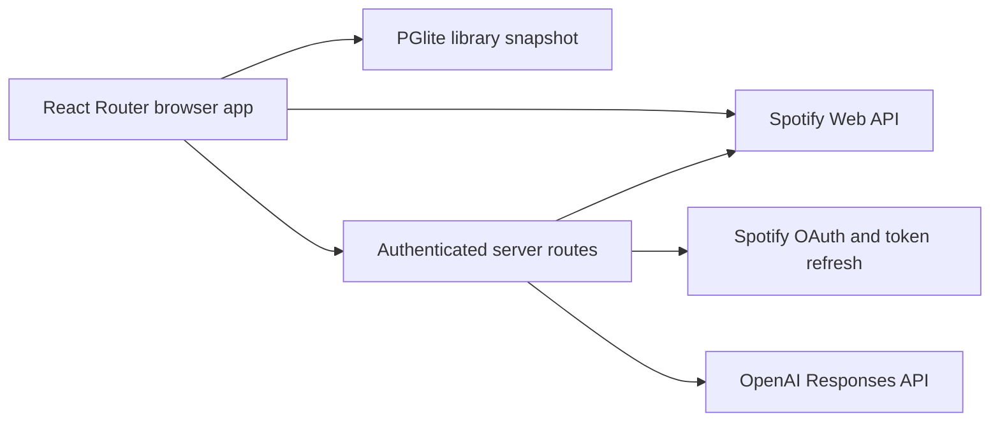

# Better Spotify

Better Spotify is a personal music workspace for exploring listening history,
rediscovering artists, and curating playlists from a Spotify library.

The app keeps an account-scoped read model in browser-local PGlite, uses Spotify
as the identity and playlist system of record, and runs structured curation
through OpenAI's `gpt-5.6-luna` Responses model.

## What works

- Spotify OAuth with exact state validation, safe callback handling, and automatic token refresh
- Top, liked, and recently played music synchronized into local PGlite
- Artist, album, track, search, and playlist exploration
- Selection-based playlist building and artist discovery
- Stale-source guarded playlist modification through Spotify's current `/items` API
- Responsive dark UI with non-blocking background synchronization
- Healthcheck, frozen installs, CI quality gates, and a minimal Bun container

## Stack

- Bun 1.4
- React 19 and React Router 8
- TypeScript 7 and Vite 8
- Tailwind CSS 4 and Radix UI
- Drizzle ORM and PGlite
- AI SDK 7 with the OpenAI provider
- Arctic 3 for Spotify OAuth
- Zod 4 for request and model-output contracts

All direct runtime and development packages are kept on current stable releases.
Run `bun outdated` to verify that invariant after dependency changes.

## Architecture


```mermaid
flowchart LR
    Browser[React Router browser app] --> Cache[PGlite library snapshot]
    Browser --> SpotifyAPI[Spotify Web API]
    Browser --> Routes[Authenticated server routes]
    Routes --> SpotifyOAuth[Spotify OAuth and token refresh]
    Routes --> SpotifyAPI
    Routes --> OpenAI[OpenAI Responses API]
```

The important seams are intentionally narrow:

- `app/auth/` owns OAuth, signed sessions, refresh, and the public-user boundary.
- `app/spotify/api/spotifyWebApi.ts` owns Spotify's current endpoint and response
  compatibility behavior.
- `app/spotify/sync/spotifySync.client.ts` serializes manual and scheduled cache
  synchronization per Spotify account so refresh jobs cannot race or coalesce
  across accounts.
- Full refreshes build in a transient PGlite database and publish through one
  local transaction, keeping the last complete account snapshot readable while
  Spotify pagination is in flight. Saved tracks stream into that transient
  snapshot page by page, with a 5,000-request circuit breaker instead of the
  obsolete 10,000-track ceiling.
- Optional artist-image enrichment runs in small best-effort incremental
  batches, so large libraries or one failed artist lookup cannot block the core
  snapshot.
- `app/spotify/playlistBuilder/aiGeneration.server.ts` owns the OpenAI model
  contract; each use case owns a strict schema and pure prompt/normalizer.
- Route actions authenticate, validate a bounded request, call one domain
  interface, and shape the response.

Read [CONTEXT.md](CONTEXT.md) for domain language and invariants, and
[ADR 0001](docs/adr/0001-deepen-external-service-boundaries.md) for the boundary
decision.

## Local setup

Requirements:

- Bun 1.4.0
- A Spotify developer application whose owner has an active Premium subscription
- An OpenAI API key for playlist curation

Spotify Development Mode allows at most five authenticated users per app. Add
every account that will log in under the app's **Users Management** allowlist in
the Spotify Developer Dashboard; an unlisted user can complete OAuth but their
API requests will receive `403` responses.

Copy the example environment file and fill in its values:

```bash
cp .env.example .env
bun install --frozen-lockfile
bun run dev --host 127.0.0.1 --port 5173
```

Register this exact redirect URI in the Spotify developer dashboard:

```text
http://127.0.0.1:5173/auth/callback
```

Spotify does not accept `localhost` as a redirect host. The scheme, loopback IP,
port, path, and `APP_URL` must match exactly.

Spotify's full-replace playlist endpoint does not accept a `snapshot_id`
precondition. The app compares the loaded snapshot and ordered source tracks
before curation, then rechecks them immediately before replacement. That
prevents ordinary stale writes, but a small final read-to-write race remains at
Spotify's API boundary.

For a local production-mode smoke test after building, use the same filled-in
environment file (with a 32-byte-or-longer session secret):

```bash
NODE_ENV=production bun --env-file=.env run start
```

### Environment variables

| Name | Purpose |
| --- | --- |
| `APP_URL` | Public origin used to construct the OAuth callback |
| `SPOTIFY_CLIENT_ID` | Spotify application client ID |
| `SPOTIFY_CLIENT_SECRET` | Spotify confidential-client secret |
| `SESSION_SECRET` | Cookie-signing secret |
| `OPENAI_API_KEY` | Server-side OpenAI credential |

In production, `SESSION_SECRET` must be a random value of at least 32 bytes:

```bash
openssl rand -base64 32
```

React Router cookie sessions are signed, not encrypted. `HttpOnly`, `Secure`,
and `SameSite` protect normal browser access and transport, but the cookie is
client-held and its refresh-token payload is decodable. Stronger token
confidentiality and centralized revocation require durable server-side session
storage, or an intentional encryption and key-rotation design. Logout expires
the browser's current cookie; stateless storage cannot revoke a copied older
cookie or a refresh response already in flight.

Refresh rotation coordination is process-local. Horizontal or overlapping app
instances need durable server-held tokens or distributed coordination to avoid
refreshing the same rotating credential concurrently. Arctic 3.7 also does not
expose an abort signal for Spotify's token and profile requests, so those calls
remain subject to the runtime's network timeout; a non-aborting `Promise.race`
would be unsafe because a late response may contain a rotated refresh token.

Browser caches are durable and namespaced by Spotify account ID. Logging out
does not delete an account's PGlite library or Playlist Builder draft: deletion
would race in-flight browser work, while account-scoped storage already prevents
a later account from reading or joining it. The former unscoped PGlite database
and Playlist Builder key are deliberately never adopted; the obsolete builder
key is removed opportunistically. Clearing site data remains the explicit way
to remove all local caches.

## Verification

```bash
bun install --frozen-lockfile
bun outdated
bun run check
bun audit
docker build -t better-spotify:check .
```

`bun run check` runs the Bun tests, Oxlint with warnings denied, React Router
type generation, strict TypeScript, and both production client and SSR builds.
Authentication and visual changes still require a real browser pass.

The current latest `drizzle-kit` transitively retains one development-only
moderate esbuild advisory. It is not part of the production dependency install;
do not force an incompatible override merely to hide the audit result.

## Deployment

The Dockerfile builds and runs the React Router server with Bun. `/healthcheck`
returns a no-store JSON response for runtime probes. The Fly workflow runs frozen
install, tests, typecheck, and production build before deployment.

No local verification command deploys or mutates Fly infrastructure.
