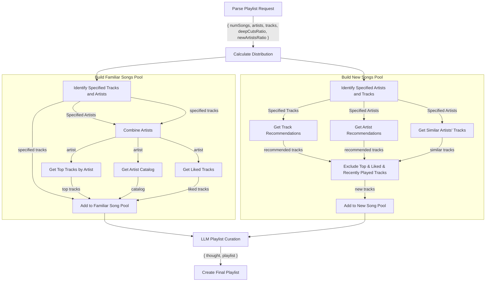

# Playlist Builder Algorithm



### **Algorithm Overview with Updated Parameters**

1. **Parse the Playlist Request**:

   - Extract specified tracks, artists, `numSongs`, `NewArtistsRatio`, `DeepCutsRatio`.

2. **Calculate the Distribution of Songs**:

   - Determine the number of familiar songs and new songs based on `NewArtistsRatio`.

3. **Build the Familiar Song Pool**:

   - Include specified tracks.
   - Include `liked_tracks` from specified artists and artists of specified tracks
   - Include `top_tracks` from specified artists and artists of specified tracks
   - Include full catalogs from specified artists and artists of specified tracks
     - Use DeepCutsRatio to determine which 100 to choose based on popularity?

4. **Build the New Song Pool**:

   - Fetch songs from new artists not in `top_artists`.
   - Use recommendations based on specified tracks and artists.
   - Include popular songs by similar artists.
   - Exclude any tracks already in `top_tracks` or `liked_tracks`, or recent `play_history`

5. **LLM Playlist Curation**:

   - Pass both song pools and playlist parameters to LLM
   - LLM returns structured response with thought process and final playlist
   - Use the NewArtistsRatio to determine how many familair songs vs new songs to use
   - Automatically include specified tracks.
   - Select from pool of Familiar Songs by distributing songs between `top_tracks`, `liked_tracks` and popular
     songs vs deep cuts based on `DeepCutsRatio`.
   - Tell the LLM to heavily favor `liked_tracks` for any songs it selects that aren't deep cuts. but we also want
     to leave room for variety.
   - Tell the LLM to select a diverse set of new songs that pair well with the chosen familiar songs.

6. **Create Final Playlist**:

   - Use the LLM-generated track list and name to create the playlist

---

### **Applying the Algorithm to Your Example Request**

**User Request**:

"Create me a playlist with Thinking 'Bout Love by Wild Rivers, some Lake Street Dive, and Red Clay Strays, minimal deep cuts, and 30% new stuff."

**Interpretation**:

- **Specified Tracka**: "Thinking 'Bout Love" by Wild Rivers
- **Specified Artists**: Lake Street Dive, Red Clay Strays
- **DeepCutsRatio**: Minimal deep cuts ⇒ `DeepCutsRatio` ≈ 0.1
- **NewArtistsRatio**: 30% ⇒ `NewArtistsRatio` = 0.3
- **Number of Songs**: Not specified; let's assume a default of 30 songs

---

### **Detailed Steps**

#### **Step 1: Parse the Playlist Request**

- **Specified Track**:

  - "Thinking 'Bout Love" by Wild Rivers

- **Specified Artists**:

  - Lake Street Dive
  - Red Clay Strays

- **Parameters**:
  - `numSongs`: 30 (default)
  - `NewArtistsRatio`: 0.3
  - `DeepCutsRatio`: 0.1 (minimal deep cuts)

#### **Step 2: Calculate the Distribution of Songs**

```
numNewSongs = numSongs × NewArtistsRatio
            = 30 × 0.3
            = 9

numFamiliarSongs = numSongs - numNewSongs
                 = 30 - 9
                 = 21
```

#### **Step 3: Build the Familiar Song Pool**

**a. Process Specified Content**

- Include specified tracks directly
- Identify all specified artists
- Include artists from specified tracks

**b. Gather Familiar Songs**
For each artist:

- Fetch top tracks
- Fetch full artist catalog
- Fetch user's liked tracks by the artist

**c. Combine into Familiar Songs Pool**

```ts
const familiarSongsPool = {
  specifiedTracks: [trackA],
  topTracks: {
    artistA: [tracks...],
    artistB: [tracks...],
  },
  artistCatalog: {
    artistA: [tracks...],
    artistB: [tracks...],
  },
  likedTracks: {
    artistA: [tracks...],
    artistB: [tracks...],
  }
};
```

#### **Step 4: Build the New Song Pool**

**a. Process Input for Recommendations**

- Use specified tracks and artists as seeds

**b. Gather New Songs From Multiple Sources**

- Get recommendations based on specified tracks excluding specified artists
- Get recommendations based on specified artists excluding specified artists
- Get similar artists' tracks excluding `top_artists`

**c. Filter New Songs**

- Exclude tracks that appear in:
  - User's top tracks
  - User's liked tracks
  - User's recent play history
  - Songs by specified artists

#### **Step 5: LLM Playlist Curation**

Pass to LLM:

- Familiar songs pool
- New songs pool
- Original request parameters (`DeepCutsRatio`, `NewArtistsRatio`, etc.)
- Request structured response:

```typescript
interface LLMResponse {
  thought: string; // Summary of request and curation strategy
  playlist: {
    name: string; // 2-3 word generated name
    track_ids: string[]; // Final ordered track list
  };
}
```

#### **Step 6: Create Final Playlist**

- Use the LLM-generated track list and name to create the playlist in Spotify
- Playlist name format: "YYYY-MM-DD - {LLM generated name}"
