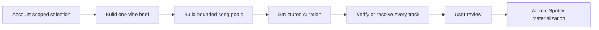

# Playlist Builder process

The Playlist Builder turns an account-scoped selection into a bounded curation
proposal, verifies every proposed track against Spotify, and only then creates
or replaces a playlist. Spotify remains the system of record; model output is
never treated as a Spotify identifier authority.

```mermaid
flowchart LR
    Selection[Account-scoped selection] --> Brief[Build one vibe brief]
    Brief --> Pool[Build bounded song pools]
    Pool --> Model[Structured curation]
    Model --> Verify[Verify or resolve every track]
    Verify --> Review[User review]
    Review --> Write[Atomic Spotify materialization]
```

## 1. Capture an account-scoped selection

The browser service stores selected tracks, artists, preferences, and computed
results under a cache key namespaced by Spotify account ID. Switching accounts
replaces the active service and prevents a previous listener's tokens or
selection from being reused.

Inputs are bounded at the authenticated route boundary. The current controls
include a requested song count, a `none` / `sprinkle` / `half` / `all` new-music
preference, and optional custom instructions.

The server turns the selected artists, selected tracks, and exact custom
instructions into one typed vibe brief. Its concise profile covers mood,
energy, tempo feel, genre boundaries, era, vocals, instrumentation, production
texture, positive anchors, negative constraints, and playlist arc. Explicit
instructions take precedence over anything inferred from the selected music.

## 2. Build candidate pools

The familiar pool combines:

- explicitly selected tracks;
- liked and top tracks by selected artists;
- supported Spotify album/single catalog results for selected artists; and
- recent listening context.

New-artist candidates are ranked against the same vibe brief, normalized,
deduplicated, and filtered against both selected and familiar artists. The
model returns a small overflow buffer so failed Spotify matches do not
immediately underfill discovery. Each name must match an exact normalized
Spotify search result before use.

For each verified artist, the compatibility adapter loads a bounded set of
albums and singles in deterministic release order. The resulting candidates
retain release and Spotify metadata. A round-robin cap prevents one artist's
catalog from crowding out the others before final curation.

## 3. Generate a structured proposal

`aiGeneration.server.ts` is the sole model configuration seam. It calls
`gpt-5.6-luna` through OpenAI's Responses API with storage disabled. Each use
case supplies separate instructions, a bounded prompt, and a strict Zod output
schema.

The playlist schema requires exactly the requested number of tracks. A model
may retain a non-empty Spotify ID only when that exact ID was supplied in a
candidate pool. It must leave the ID empty for a music-knowledge suggestion.
No hidden chain of thought is requested or stored.

Final curation receives the same vibe brief used for discovery, along with the
bounded familiar and new-song pools. It therefore sequences one shared
interpretation of the request instead of independently guessing the vibe a
second time.

## 4. Resolve before writing

Every returned track is checked before Spotify is mutated:

1. A supplied ID is replaced with the canonical metadata from the verified
   input pool.
2. A missing or untrusted ID is searched by track and artist.
3. Only an exact normalized name and artist match is accepted.
4. If any track cannot be resolved, the whole operation aborts.

This all-or-nothing resolution prevents partial or silently truncated
playlists.

## 5. Materialize atomically

A new playlist is created only after all proposed tracks resolve. Existing
playlist modifications validate and resolve the complete target list before a
single Spotify replace-items request. The app never clears a playlist first,
and it never replaces from a partially paginated source playlist.

## 6. Stream progress and reconnect safely

The authenticated build route starts one idempotent, account-scoped server job
and returns an AI SDK UI-message stream. Typed `data-progress` parts report the
candidate, curation, verification, and Spotify-write phases. During structured
generation, partial output reports the number of drafted songs; a heartbeat
keeps quiet portions of the stream alive without exposing model reasoning.

The browser persists the active job ID under the Spotify account and reconnects
with an authenticated GET after a network interruption, page reload, or phone
wake. Completion and failure remain replayable for one hour, so losing the
original response does not cause an automatic duplicate playlist creation.
The server job never uses the browser request's abort signal.

Fly autostop is disabled because Fly Proxy does not count background work after
the browser connection closes. This keeps the single web process alive during a
mobile disconnect, with the tradeoff that the Machine incurs continuous runtime
cost.

The current job registry is still process-local. It protects normal mobile
sleep and reload behavior while the Fly process remains alive, but a deploy or
process crash removes in-flight state. Surviving those events requires a shared
durable job and stream store before running more than one application process.

## Verification

Contract tests cover model configuration, schema bounds, prompt normalization,
exact Spotify matching, canonical metadata, unresolved-track failure, complete
playlist pagination, account isolation, authentication, atomic replacement,
typed progress streaming, idempotent jobs, and completion replay.
Run the complete suite with `bun run check`.
